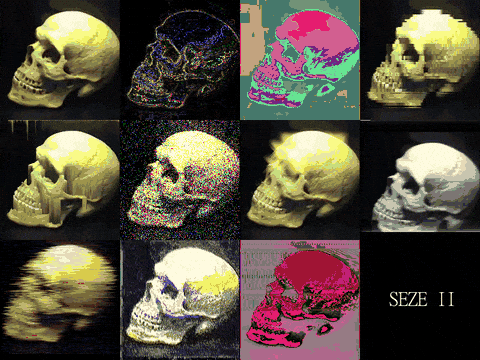

# SEZE II
[Смотреть на русском](README_RU.md)

SEZE is a plugin-based video converter for Windows/Linux. You can write your video filter in C++ (see section "How to make video effect"). Output video is a lossless H264 RGB24 format and not contain audio.
+ CLI version usage example: ```seze -i "path_to_your_vid.mp4" -o "path_to_output.mkv" --plug "path_to_plugin"```.\
Execute ```seze``` without options or with ```-h``` for watch avaliable commands
+ GUI version - launch ```seze-gui```

Fast drag'n'drop scripts avaliable for Windows (see ```bin/scripts``` folder)
### Example effects
[Video demo + tutorial on russian](https://youtu.be/Knt6QhNY00c)

Gif demo:\

### Used libs
+ [FFmpeg](https://github.com/FFmpeg/FFmpeg) (4.3.1) - © Free Software Foundation, Inc. [License](https://github.com/FFmpeg/FFmpeg/blob/master/LICENSE.md)
+ [DyLib](https://github.com/tocola/DyLib) (1.6.1) - © Martin Olivier, MIT license
+ [itlib](https://github.com/iboB/itlib) - © Borislav Stanimirov, Chobolabs Inc. MIT license
+ [SDL2](https://www.libsdl.org) (2.0.12) - © Sam Lantinga, [Zlib license](https://www.zlib.net/zlib_license.html)
+ [libgcc, libstdc++](http://fsf.org/) (tdm-1 10.3.0) - © Free Software Foundation, Inc
### Used tools
+ [UPX](https://upx.github.io) - © Мarkus Oberhumer, Laszlo Molnar & John Reiser
+ [pyinstaller](https://www.pyinstaller.org/) - © PyInstaller Development Team, [GPL](https://www.pyinstaller.org/license.html)
+ [SCons](https://scons.org/) - © SCons Foundation, MIT
### How to build
* See [Build info](resources/how2build.md)
### How to make video effect
* See [Plugin dev. info](resources/how2plugin.md)
### Donate
* Visa/MCard: 5469 1300 1242 7256
* [ЮMoney](yoomoney.ru/to/410017516566873)
* [PayPal](paypal.me/AtariSMN81)
### SEZEII License
* [MIT license](LICENSE)
***
Copyright © 2021-2022, [HPW-dev](mailto:hpwdev0@gmail.com)
