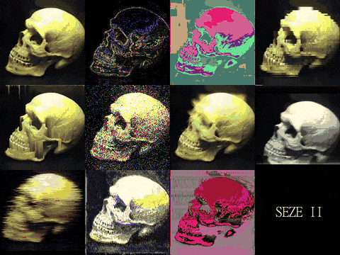

# SEZE II
[Watch on English](README.md)

SEZE это плагин-ориентированный видео кодировщик. Доступен для Windows/Linux. Вы можете написать для него собственный видео фильтр на C++ (см. раздел "Как создать свой эффект") Выходное видео не содержит аудио и получается в H264 RGB24 формате.
+ Пример работы в консоли: ```seze -i "путь к вашему видео.mp4" -o "путь к выходному видео.mkv" --plug "путь до плагина"```.\
Запустите ```seze``` без параметров или с опцией ```-h``` чтобы увидеть доступные команды
+ Графическая версия - просто запустите ```seze-gui```

Быстрые drag'n'drop скрипты доступны для Windows (смотрите в папке ```bin/scripts```)\
Просто перетащите видео файл на значок файла скрипта
### Примеры эффектов
[Видео демонстрация + гайд по установке и запуску](https://youtu.be/Knt6QhNY00c)

Гифка с эффектами:\

### Используемые модули
+ [FFmpeg](https://github.com/FFmpeg/FFmpeg) (4.3.1) - © Free Software Foundation, Inc. [License](https://github.com/FFmpeg/FFmpeg/blob/master/LICENSE.md)
+ [DyLib](https://github.com/tocola/DyLib) (1.6.1) - © Martin Olivier, MIT license
+ [itlib](https://github.com/iboB/itlib) - © Borislav Stanimirov, Chobolabs Inc. MIT license
+ [SDL2](https://www.libsdl.org) (2.0.12) - © Sam Lantinga, [Zlib license](https://www.zlib.net/zlib_license.html)
+ [libgcc, libstdc++](http://fsf.org/) (tdm-1 10.3.0) - © Free Software Foundation, Inc
### Используемые инструменты
+ [UPX](https://upx.github.io) - © Мarkus Oberhumer, Laszlo Molnar & John Reiser
+ [pyinstaller](https://www.pyinstaller.org/) - © PyInstaller Development Team, [GPL](https://www.pyinstaller.org/license.html)
+ [SCons](https://scons.org/) - © SCons Foundation, MIT
### Как компилировать
* Смотрите [инструкцию по компиляции](resources/how2build_ru.md)
### Как создать свой эффект
* Смотрите [инструкцию по созданию плагинов](resources/how2plugin_ru.md)
### Донат
* Visa/MCard: 5469 1300 1242 7256
* [ЮMoney](yoomoney.ru/to/410017516566873)
* [PayPal](paypal.me/AtariSMN81)
### SEZEII лицензия
* [MIT license](LICENSE)
***
Copyright © 2021-2022, [HPW-dev](mailto:hpwdev0@gmail.com)
